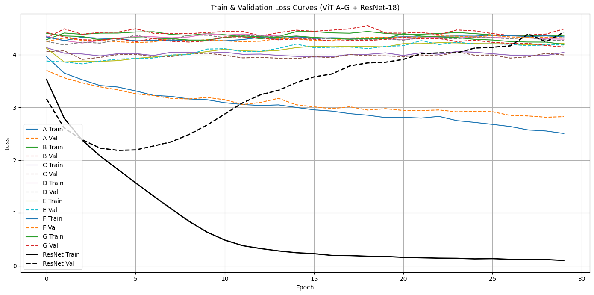

# ECGR-5106-H6

# Homework 6 Report

**Name:** Liyuan Zhang  
**Student ID:** 801432783  
**Course:** ECGR-5106-001  
**Homework Number:** Assignment 6  
**GitHub:** [https://github.com/LeeYuuuan/ECGR-5106-HW6](https://github.com/LeeYuuuan/ECGR-5106-HW6)

---

## Problem 1: Vision Transformer on CIFAR-100

### 1. Setup

- **Dataset:** CIFAR-100 (32x32 RGB images, 100 classes)
- **Models Compared:**
  - Vision Transformers (7 variants, from scratch)
  - ResNet-18 (CNN baseline)
- **Environment:** Google Colab with A100 GPU
- **Hyperparameters:**
  - Optimizer: Adam
  - Learning rate: 0.001
  - Batch size: 64
  - Epochs: 30

---

### 2. Vision Transformer Configurations

| Config | Patch Size | Embedding Dim | Layers | Heads | MLP Dim |
|--------|------------|---------------|--------|-------|---------|
| A      | 4x4        | 256           | 4      | 2     | 512     |
| B      | 4x4        | 512           | 8      | 4     | 2048    |
| C      | 8x8        | 256           | 4      | 2     | 512     |
| D      | 8x8        | 512           | 8      | 4     | 2048    |
| E      | 8x8        | 256           | 8      | 4     | 512     |
| F      | 8x8        | 512           | 8      | 4     | 2048    |
| G      | 8x8        | 512           | 4      | 2     | 2048    |

---

### 3. Results Summary

| Model     | Accuracy (%) | Params     | Train Time (s) |
|-----------|---------------|------------|----------------|
| ViT-A     | **29.96**     | 2.16M      | 769.26         |
| ViT-B     | 2.87          | 25.33M     | 1719.77        |
| ViT-C     | 8.87          | 2.19M      | 768.96         |
| ViT-D     | 5.14          | 25.38M     | 1070.08        |
| ViT-E     | 6.30          | 4.30M      | 1061.46        |
| ViT-F     | 4.35          | 25.38M     | 1086.53        |
| ViT-G     | 6.85          | 12.77M     | 779.88         |
| **ResNet-18** | **44.31** | 11.23M     | 688.21         |

---

### 4. Loss Curve



> *Figure 1: Training and validation loss curves for ViT variants and Resnet18

The loss curves in the figure below illustrate the training and validation trends across ViT configurations. Only ViT-A shows consistent convergence in both train and val loss. Other configurations just stagnate at high loss values, indicating unstable or failed training.

In contrast, ResNet-18 demonstrates smooth convergence up to around epoch 9, reaching its peak accuracy (44.31%), followed by signs of overfitting as validation loss increases.


---

### 5. Analysis

#### 5.1. **Accuracy vs model size:** 

Only ViT-A achieved reasonable accuracy (about 30%), while all other ViT models underperformed dramatically, achieving below 10% accuracy. In contrast, ResNet-18 achieved 44.31%, outperforming all ViT variants. Notably, the best-performing ViT (A) was also one of the smallest in terms of parameters (2.16M), while the worst-performing models (B, D, F) had over 25M parameters.

Several factors might contribut to the poor performance of most ViT configurations:
- **Oversized models:** B, D, and F were too large for CIFAR-100. Without pretraining, they overfit or failed to converge.
- **Improper learning rate:** A fixed learning rate of 0.001 was too aggressive for deeper architectures.
- **Lack of regularization:** No dropout, weight decay, or learning rate scheduling was used, which is crucial for training ViTs from scratch.
- **Short training schedule:** 30 epochs is insufficient for large transformer models to converge from scratch.
- **Architectural simplicity helped:** ViT-A, with fewer layers, smaller embedding, and fewer heads, matched the dataset size better.

#### 5.2 **Computational Cost vs Performance**

Larger ViT configurations required significantly more training time (up to 1700s for B) but yielded worse accuracy. ResNet-18 trained faster (688s) and generalized better. This indicates that increasing computational complexity in ViTs does not guarantee better performance—especially without pretraining, careful tuning or matching best model size.

Also for this task, 4x4 patches resulted in better granularity but more patches, whereas 8x8 patches reduced the performance.

---

### 6. Conclusion

ResNet-18 not only outperformed all ViT variants in accuracy, but also trained faster and more stably. It remains a strong baseline for small image classification tasks. ViTs can be competitive, but only with proper regularization, more data, or pretraining. Among the scratch-trained ViTs, configuration A offers a good balance and may serve as a starting point for lightweight transformer design on CIFAR-scale datasets.


---

# Problem 2: Fine-Tuning Swin Transformers on CIFAR-100

## 1. Objective

This task focuses on fine-tuning pretrained Swin Transformer models on the CIFAR-100 dataset and comparing their performance to a Swin Transformer initialized from scratch. The goal is to evaluate the impact of pretraining and model size on classification accuracy and training efficiency.

## 2. Experimental Setup

- **Dataset:** CIFAR-100 (100 classes)
- **Input Resolution:** 32x32 resized to 224x224
- **Models:**
  - `microsoft/swin-tiny-patch4-window7-224`
  - `microsoft/swin-small-patch4-window7-224`
  - Scratch-initialized Swin-Tiny
- **Preprocessing:**
  - Resizing to 224x224
  - Normalization using model-specific `image_mean` and `image_std`
- **Training Config:**
  - Batch Size: 32
  - Optimizer: Adam
  - Learning Rate: 2e-5
  - Epochs: 3
  - Loss: CrossEntropyLoss
  - Backbone: Frozen for pretrained models; scratch version not trained
- **Environment:** Google Colab (T4 GPU)

## 3. Implementation Details

All models were loaded using Hugging Face's `SwinForImageClassification`. The classification head was adjusted to output 100 classes using the `num_labels=100` argument. The `ignore_mismatched_sizes=True` flag was used to avoid loading mismatched classification head weights from ImageNet-pretrained models. Backbone parameters were frozen for fine-tuning to limit training to the classification head.

```python
model = SwinForImageClassification.from_pretrained(
    "microsoft/swin-tiny-patch4-window7-224",
    num_labels=100,
    ignore_mismatched_sizes=True
)
```

The scratch-initialized Swin-Tiny model was created using `SwinConfig` and evaluated directly without training.

## 4. Results

| Model                                | Pretrained | Accuracy (%) | Avg Train Time / Epoch (s) |
|-------------------------------------|------------|---------------|-----------------------------|
| Swin-Tiny (scratch, eval only)      | No         | 0.74          | 0.00                        |
| Swin-Tiny (fine-tuned)              | Yes        | 62.62         | 276.65                      |
| Swin-Small (fine-tuned)             | Yes        | 66.71         | 443.25                      |


## 5. Analysis (To be completed after results)

- **Fine-tuned vs Scratch:**
   
   The Swin-Tiny model initialized from scratch achieved only 0.74% accuracy when evaluated without training, confirming that pretrained weights are essential for performance. In contrast, the fine-tuned Swin-Tiny reached 62.62% accuracy after 3 epochs with only the classification head trained.


- **Swin-Tiny vs Swin-Small:**
  
  Swin-Small outperformed Swin-Tiny by approximately 4%, achieving 66.71% accuracy versus 62.62%. This improvement comes with increased training time (443s per epoch vs 276s), reflecting the additional complexity and capacity of the Small variant.


- **Training Efficiency:**
  
  Both models required relatively little training (3 epochs) thanks to backbone freezing. The Swin-Tiny model is more efficient computationally and offers a good trade-off between speed and accuracy for resource-limited settings.


- **Takeaways on Transfer Learning:**
  
  These results clearly demonstrate the power of pretrained transformer backbones. Even with minimal training (only classification head), models adapted well to CIFAR-100. Pretraining enables faster convergence and significantly better generalization.


## 6. Conclusion (To be completed after analysis)

Fine-tuning pretrained Swin Transformer models on CIFAR-100 yields significant improvements compared to using models training from scratch. Swin-Small performs better than Swin-Tiny, but with higher computational cost. Overall, Swin-Tiny offers a balanced trade-off, while Swin-Small is ideal when higher accuracy is needed and resources permit.


